#Jane Doe Web: Design Development & Maintenance 
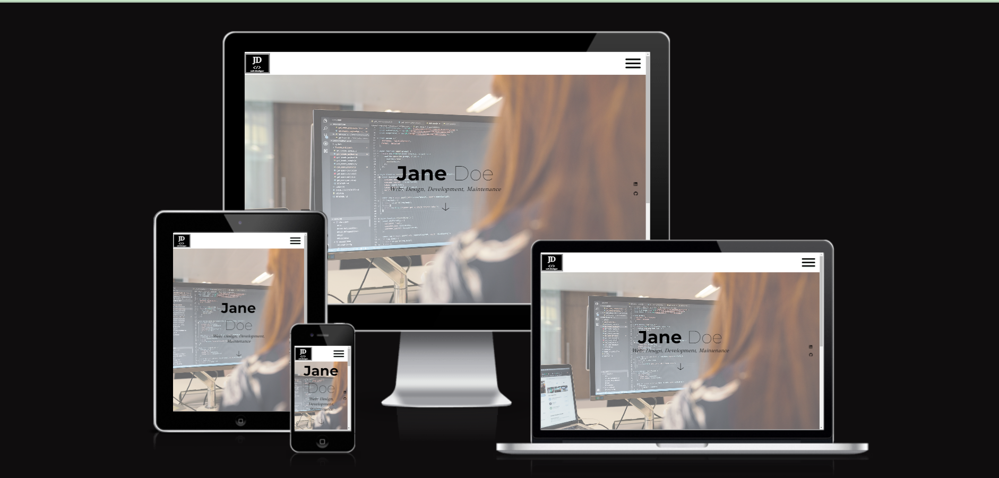

 Is a freelancer web portfolio. Jane Doe hopes to establish her online presence and attract potential customers by displaying custom made web templates. Web site clearly specifies all the required information and services for the clients i.e. customization option and how to reach out for more prize quote. 

Site targets customers with low budget/startups, who do not require fully custom-made design, but in a same time they would welcome help with color scheme, font choice, basic SEO etc. Site itself should serve as advertisement tool by displaying clean minimalistic design. Also, it is simple and intuitive to use with not technically savvy client in mind.

##Existing features
###Navigation Hamburger menu with custom made logo

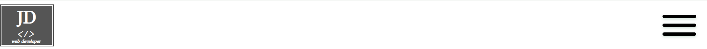
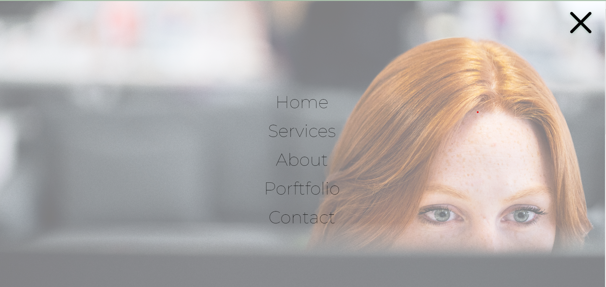

Featured on all four pages, the full responsive navigation hamburger menu expands into full navigation when hamburger icon is clicked. Navigation also includes Services link, which is a section of home page.  

Another part of navigation bar is custom coded simple logo.  Section will allow the user to easily navigate from page to page across all devices without having to revert back to the previous page via the ‘back’ button. 

###Scroll smoothly to Services section
Used scroll down feature from within hero image section and it is intuitively marked using arrow down icon.   

###Scroll smoothly to top
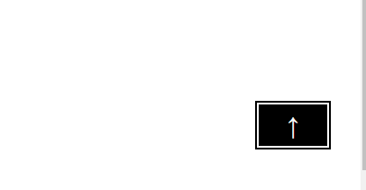 
 
This featured button allows easy navigation within same page and brings user back to the top. Smooth scroll is implemented for this feature.

###Hamburger  menu Animation 
Design choice to improve user experience.

###The landing page image 
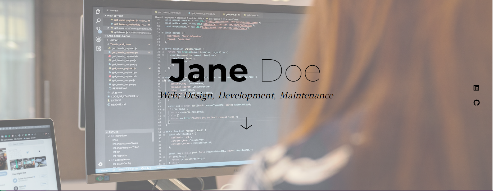
The landing includes a photograph of a Developer to help user to imagine person behind all the templates. Image is visually appealing showing Jane coding. I used background image for expanded mobile navigation showing coder from different angle 

###Services section
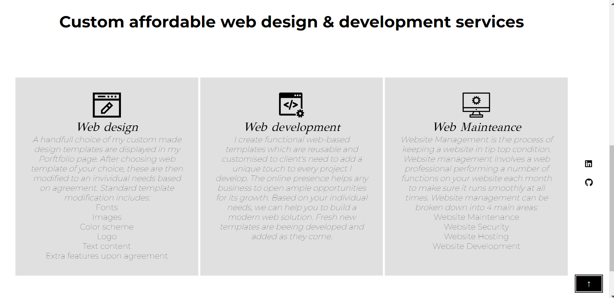
Provides further details about services Jane is providing , highlights main pros to opt out for this options as low budget, quick servise and clarity what choice of customisations users have.

###About page 
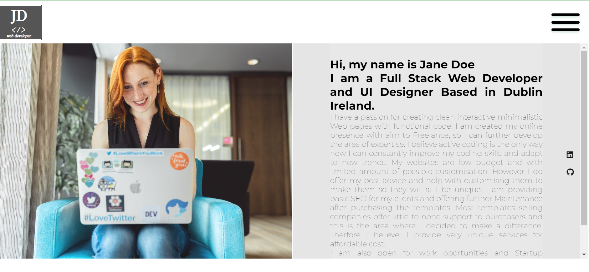
Section outlines image of Jane on the left and text on the right. To accommodate for longer conntent I allowed for vertical scrolling feature as for design to be consistent it required equal height of the image and text area. Users can build trust by getting more information about coder.

###Portfolio page 
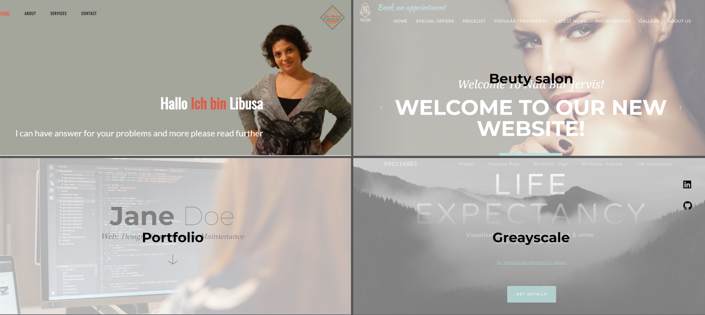
I got inspired by Love running landing page and I kept size scaling element hidden of hover. Applied nice transition to iprove user experience. All links opens i sepearate page, so user is not redirected.
lso faded gradient overlay on  background images to give user clearer preview  before the click. All links are leading to live websites coded in the past.
 

###Contact page 
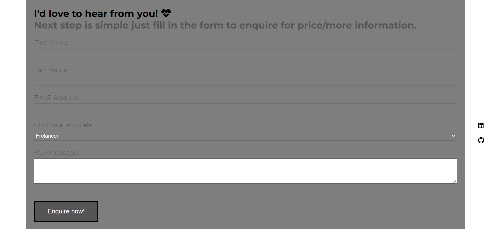
I kept it simple not to distract user with anything else, but writing the message.  I included select element to let user to choose from templates. 

###Floating social media icpms

Social media are at the fixed position, constantly appearing  on the right hand site of the page voiew and they are valueable source for further research if clients are interested.

###Footer 
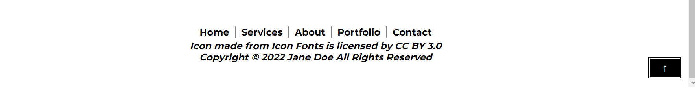
The footer section includes links to all the pages. I thought this will improve page menu accessibility as my navigation is not sticky , but sits at the top and also requires expansion.  

##Testing
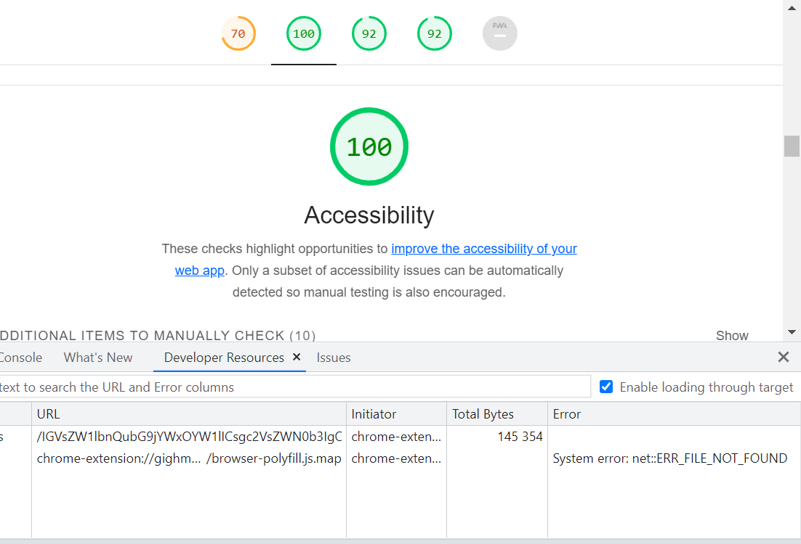
Contact form validates inputs
-All links are working
-Website tested in various browsers and using onlinte tools.
-Also tested with Lighthouse in developer tools for Accessibility among others.

##Validator testing
W3C HTML Validator still has parsing errors associated with blank space in the code
W3C CSS Validation fully passed

##Unfixed bugs
-Active class does not add when user scrolls to Services section.
-Form on submit click redirects to different page. The best practise would be if user is not redirected at all. 
-Smooth scrolling is not working when user redirect to Services section to other page

##Fixed bugs
-I had issue with the the footer , which had absolute positioning . I aimed for versatile  CSS , which would keep footer on the bottom of the page even on short pages. However min-height Css property haven't worked well together with box-sizing property and padding-bottom property applied to body element. It did not allow for extra padding , which was  required for longer pages.Therfore page never expanded below the content as padding was included in minimum heith value. I have not short pages in this project, so there was not need to use minimum height property and I left it out at this instance

-Also I have ommitted overflow hidden style rule for element which contained floated elements in portfolio page.  This distorted the page and I had to narrow a problem further down. I had no same issue with About page. So to identify  which rule is causing issue. I broke the  code into smaller chunks to spot diffence in code between two pages.  I added required property to fix the issue

-font Awesome not loading icons. This was related to my older subscription to Font awesome still running running old version. I upgrated the package and my icons started to load.

##Deployment
Link to live website: .

##Credits
My images are sources from [Pexels](https://www.pexels.com)
My icons are courced from [Online Web Fonts]( https://www.onlinewebfonts.com/icon/search?q=web+design) and I also used [Font Awesome]( https://fontawesome.com/).
My code for Services and Contact section have been copied  and customised from Love running project [Love Running](https://github.com/Code-Institute-Solutions/love-running-2.0-sourcecode)
I have used YouTube tutorial to create Hamburger animation [YouTube](https://www.youtube.com/watch?v=dIyVTjJAkLw&ab_channel=codeSTACKr)
And I used W3C code to help me with full overlay mobile navigation hero image text positioning. [W3C](https://www.w3schools.com/howto/howto_js_fullscreen_overlay.asp) 
I used special HTML character from [Toptal](https://www.toptal.com/designers/htmlarrows/symbols/)

Special thanks to effort of Code Institute team and to my mentor to support me along the way.

 

 